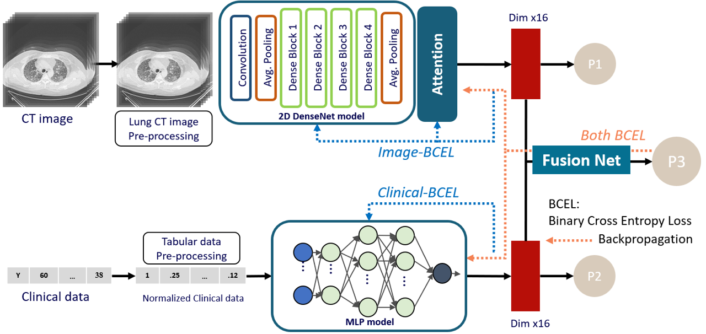
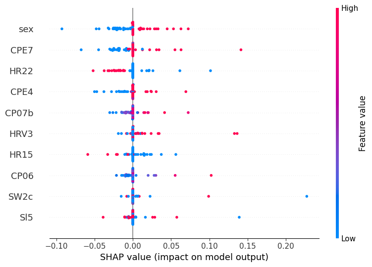
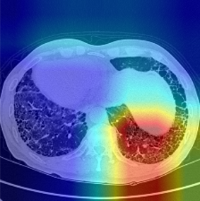
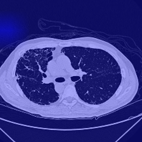

# 深度多路徑神經網路於 ILD/COPD 患者死亡風險預測

<p align="left">
  
  
  
</p>

> **碩士論文** · 國立中興大學 資訊工程學系 · 2025  
> 指導教授：吳俊霖 &nbsp;|&nbsp; 研究生：彭桂綺

---

## 作品概述

傳統臨床評估工具（如 **BODE 指數**、**GAP 指數**）僅依賴少數肺功能變數，對**間質性肺病（ILD）**與**慢性阻塞性肺病（COPD）**早期無症狀患者的風險判別效能有限，且無法有效整合影像與多維度檢測資料所蘊含的複雜病理資訊。

本研究提出一套**具缺失模態容錯能力的深度多路徑神經網路**，整合：
- **胸部 CT 影像**（每位患者 6 張 axial 軸向切片）
- **94 項臨床檢測指標**（心律貼片、CPET、肺功能、睡眠品質等）

以提升 ILD/COPD 患者**一年死亡風險預測準確度**，並提供可解釋性分析。

### 核心貢獻

| | |
|---|---|
| 🏆 **預測效能** | 雙模態 AUC **0.872**，顯著優於所有單模態基準（p < 0.05） |
| 🔧 **缺失模態容錯** | 支援「僅影像」、「僅臨床」、「雙模態」三種輸入情境；排除不完整樣本後仍維持 AUC **0.853** |
| 🔍 **可解釋性** | SHAP 識別關鍵臨床危險因子；Grad-CAM 視覺化 CT 影像中的纖維化病灶關注區域 |
| 🏥 **真實世界資料** | 使用台中榮民總醫院 2022 年 72 位 ILD/COPD 患者資料驗證 |

---

## 實驗結果

| 方法 | AUC (95% CI) | F1-Score | Accuracy |
|------|-------------|----------|----------|
| 影像單模態（CT only） | 0.758 (0.725–0.791) | 0.775 | 0.769 |
| 臨床單模態（Clinical only） | 0.840 (0.775–0.905) | 0.838 | 0.833 |
| 去除不完整樣本 | 0.853 (0.813–0.893) | 0.841 | 0.848 |
| **本研究（雙模態融合）★** | **0.872 (0.798–0.946)** | **0.861** | **0.867** |

> 採用**五折交叉驗證**，各 fold AUC 取平均。與單模態基準統計顯著性：p < 0.05。

---

## 模型架構

<p align="center">
  
</p>

整體架構由三個分支組成：

### 1. 影像分支 — DenseNet-121 + Slice Attention

- 骨幹網路：**2D DenseNet-121**（預訓練權重，第一層卷積核修改為接受單通道灰階輸入，權重取 RGB 平均後初始化）
- 6 張 axial CT 切片分別通過 DenseNet-121，提取 1024 維特徵向量
- **Slice Attention 模組**：透過兩層全連接層 + Tanh + softmax，對各切片計算注意力權重並加權融合
- 最終線性映射至 **16 維**向量，輸出影像單模態預測 P1

```
6 張 CT 切片 → DenseNet-121 → Slice Attention（softmax 加權） → 16 維向量 → P1
```

### 2. 臨床分支 — MLP

- 輸入：94 項臨床變數（Min-Max 正規化至 [0, 1]）
- 架構：**94 → 64 → 32 → 16**，各隱藏層加入 BatchNorm + Dropout（p=0.3）防止過擬合
- 輸出 **16 維**語意向量，輸出臨床單模態預測 P2

```
94 項臨床變數 → MLP（94→64→32→16） → 16 維向量 → P2
```

### 3. 特徵融合 — Fusion Net

- 兩分支 16 維向量串接（32 維）→ 全連接層 + **LeakyReLU** → 輸出雙模態融合預測 P3
- 三條路徑各自計算 **BCEWithLogitsLoss**，以可調整權重加權合併為總損失

```
[16 維影像 | 16 維臨床] → FC + LeakyReLU → sigmoid → P3（死亡機率）
```

### 缺失模態容錯設計

| 輸入情境 | 啟用路徑 | 損失函數 |
|---------|---------|---------|
| 雙模態皆有 | 影像分支 + 臨床分支 + Fusion Net | Image-BCEL + Clinical-BCEL + Both-BCEL |
| 僅有影像 | 影像分支 | Image-BCEL |
| 僅有臨床 | 臨床分支 | Clinical-BCEL |

此設計讓資料不完整的樣本仍可納入訓練，最大化樣本利用率。

---

## 可解釋性分析

### SHAP — 關鍵臨床風險因子

<p align="center">
  
</p>

SHAP（SHapley Additive exPlanations）對每個臨床特徵計算其對預測結果的貢獻程度：

- 🔴 **CPE7（血氧飽和度 SpO₂）** — 最主要的死亡預測因子，數值越低對預測死亡貢獻越大
- 🔴 **CPE4（血流動力學）** — 血流動力學下降對死亡預測具正向貢獻
- 🔴 **CP07（VDc/VT 死腔換氣比）** — 數值偏高與肺部氣體交換效率低下相關，提升死亡風險預測

### Grad-CAM — 影像關注區域對比

<p align="center">
  
  &nbsp;&nbsp;&nbsp;
  
</p>
<p align="center">
  <em>左：Patient 51（已死亡）— 熱區集中於肺部纖維化病灶 &nbsp;|&nbsp; 右：Patient 47（存活）— 幾乎無明顯關注區域</em>
</p>

高風險患者的 Grad-CAM 熱區集中於 CT 影像中的纖維化與蜂窩化病灶，符合臨床對 ILD 進展的判斷；低風險患者幾乎無明顯關注區域，模型正確辨識為低風險族群。

---

## 資料集

| 項目 | 說明 |
|------|------|
| 資料來源 | 台中榮民總醫院，2022 年 |
| 疾病類型 | 間質性肺病（ILD）/ 慢性阻塞性肺病（COPD） |
| 樣本數 | 72 位（60 位同時具備 CT 影像與臨床資料） |
| CT 影像 | 每位患者 6 張 axial 切片，灰階格式，強度正規化 |
| 臨床變數 | 94 項：心律貼片（35）、CPET（16）、肺功能（11）、運動測試（12）、睡眠品質（10）、基本資料（7）、HRV（3） |
| 預測標籤 | 一年內全因死亡（二元分類） |
| 缺失值處理 | 中位數填補 + Min-Max 正規化 |

---

## 實作細節

### 實驗環境

| 項目 | 規格 |
|------|------|
| 作業系統 | Ubuntu 22.04 |
| GPU | NVIDIA TITAN RTX（24 GB VRAM） |
| CPU | Intel Core i9-9820X @ 3.30GHz |
| 記憶體 | 64 GB |
| 深度學習框架 | PyTorch 2.4.1 + CUDA 12.0 |

### 訓練設定

- **損失函數**：BCEWithLogitsLoss（影像 / 臨床 / 融合三條路徑加權合併）
- **梯度裁剪**：gradient clipping，防止融合訓練階段梯度爆炸
- **驗證策略**：五折交叉驗證，各 fold AUC 取平均作為整體效能指標
- **正則化**：MLP 採 BatchNorm + Dropout（0.3）；影像分支使用預訓練 DenseNet-121 骨幹

### 專案結構

```
multimodal-mortality-prediction/
│
├── assets/                     # README 所需圖片
│   ├── architecture.png        # 模型架構圖
│   ├── shap.png                # SHAP 結果圖
│   ├── gradcam_p51.png         # Patient 51 Grad-CAM
│   └── gradcam_p47.png         # Patient 47 Grad-CAM
│
├── data/
│   ├── preprocess_ct.py        # CT 灰階正規化
│   └── preprocess_clinical.py  # Min-Max 正規化、中位數填補
│
├── models/
│   ├── densenet.py             # DenseNet-121（單通道修改版）
│   ├── slice_attention.py      # Slice Attention 模組
│   ├── mlp.py                  # 臨床分支 MLP
│   └── fusion.py               # Fusion Net + 缺失模態邏輯
│
├── train.py                    # 五折交叉驗證訓練迴圈
├── evaluate.py                 # AUC、F1、Accuracy 評估
├── explain_shap.py             # SHAP 可解釋性分析
├── explain_gradcam.py          # Grad-CAM 視覺化
└── README.md
```

---

## 技術棧

`Python` &nbsp; `PyTorch` &nbsp; `DenseNet-121` &nbsp; `SHAP` &nbsp; `Grad-CAM` &nbsp; `scikit-learn` &nbsp; `NumPy` &nbsp; `Linux` &nbsp; `CUDA`

---

## 論文引用

```bibtex
@mastersthesis{peng2025multimodal,
  author  = {彭桂綺},
  title   = {使用結合臨床檢查與胸部 CT 影像的深度多路徑神經網路於間質性肺病與慢性阻塞性肺病患者之死亡風險預測之研究},
  school  = {國立中興大學},
  year    = {2025},
  type    = {碩士論文}
}
```
